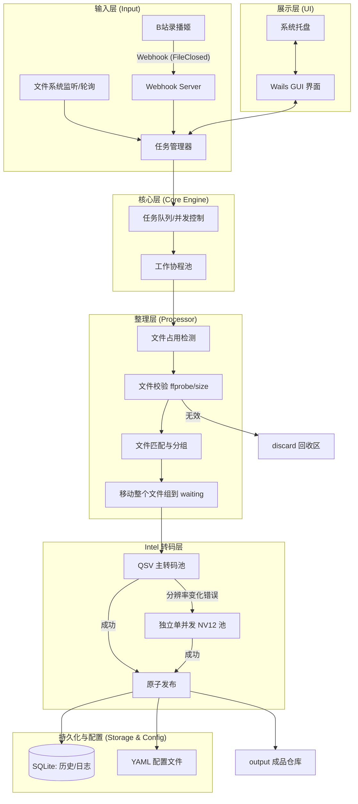

# BililiveRecorder 录制文件自动化整理工具架构设计文档

## 1. 技术选型

### 1.1 核心语言：Go (Golang)
*   **理由**：
    *   **低内存占用**：Go 的内存管理非常高效，适合长时间后台运行。
    *   **并发模型**：Goroutines 和 Channels 能够完美处理多任务并行转封装。
    *   **跨平台**：原生支持 Windows 11，且易于移植到 GNU/Linux。
    *   **单二进制文件**：编译后为一个独立的可执行文件，部署简单。

### 1.2 GUI 框架：Wails (v2/v3)
*   **理由**：
    *   **轻量级**：使用系统原生 WebView（Windows 上为 WebView2），内存占用远低于 Electron。
    *   **前后端分离**：前端可使用 Vue/React/Svelte，后端使用 Go，逻辑清晰。
    *   **易于扩展**：核心逻辑（Go）可以轻松剥离，用于开发纯 CLI 或 Web 版本。

### 1.3 关键组件
*   **FFmpeg/ffprobe**：通过 `os/exec` 调用外部二进制文件，处理大文件流。
*   **数据库**：SQLite (使用 `modernc.org/sqlite` 无需 CGO)，用于记录主播封面历史、处理日志和错误列表。
*   **配置格式**：YAML (使用 `gopkg.in/yaml.v3`)，兼顾可读性与功能性。
*   **系统托盘**：Wails 内置托盘支持或 `getlantern/systray`。
*   **Webhook 服务**：Go 标准库 `net/http`。

---

## 2. 系统架构图



---

## 3. 模块详细设计

### 3.1 任务管理器 (Task Manager)
*   **职责**：接收来自 Webhook 或手动扫描的任务，进行去重和初步过滤。
*   **并发控制**：使用带缓冲的 Channel 限制同时进行的 FFmpeg 进程数。

### 3.2 处理引擎 (Processor Engine)
*   **文件匹配**：基于正则表达式解析文件名中的日期和主播 ID。
*   **封面逻辑**：
    1.  检查同名 `.cover.jpg/png`。
    2.  若无，查询 SQLite 中该主播最近一次使用的封面。
    3.  若无，使用全局默认封面。
    4.  若无，不写入封面。
*   **整理模式**：默认 `move`，只移动 FLV/XML/封面到 waiting；兼容模式 `remux` 才预先生成 MKV。整理器到此即结束，不直接调用转码器。
*   **目录解耦**：转码调度器独立扫描 waiting；发布步骤只接收 FFmpeg 已关闭的临时文件。每一阶段以文件系统为契约，重启后不需要恢复上游内存状态。
*   **转码与封面**：正式 Intel QSV 转码时直接把外部封面映射为 `attached_pic`，不再为封面单独写一遍完整视频。
*   **安全发布**：FFmpeg 始终写 waiting 内的隐藏临时文件；成功关闭后才改名或跨盘复制并改名到 output。

### 3.3 Webhook 服务器
*   **接口**：监听指定端口（如 8080），接收 POST 请求。
*   **事件处理**：解析 `FileClosed` 事件中的文件路径，触发处理流程。

---

## 4. 配置文件结构 (config.yaml)

```yaml
# 全局设置
server:
  port: 8080
  webhook_path: "/webhook"

# 录制处理设置
processing:
  input_dir: "C:\Videos\Recordings"
  output_root: "D:\Archive\Bilibili"
  discard_dir: "D:\Archive\Discarded"
  max_concurrent: 2
  min_file_size_kb: 1024
  check_video_stream: true

# 命名与目录规则
rules:
  # 主播名解析正则：第一个 - 后的字符
  streamer_name_regex: "-([^\-]+)"
  # 日期解析正则
  date_regex: "(\d{8})"
  # 输出路径模板
  path_template: "{{.OutputDir}}\{{.Streamer}}\{{.Year}}\{{.Month}}\{{.Day}}"

# 封面设置
covers:
  default_cover: "C:\Assets\default.jpg"
  save_history: true

# FFmpeg 设置
ffmpeg:
  path: "ffmpeg"
  ffprobe_path: "ffprobe"
  custom_args: ["-c", "copy"]
```

---

## 5. 数据流程

1.  **触发**：录播姬完成录制，发送 Webhook 信号。
2.  **入队**：任务进入队列，状态设为 `Pending`。
3.  **检测**：Worker 尝试以读写模式打开文件，若失败（被占用）则等待并重试。
4.  **校验**：调用 `ffprobe` 检查是否有视频流，检查文件大小。
5.  **匹配**：搜索同目录下匹配的 XML 和图片。
6.  **整理**：默认把完整文件组移动到 waiting，并加入转码队列。
7.  **归档**：
    *   成功：在 waiting 完成 Intel QSV 转码，再原子发布视频和 XML 到 output，清理 waiting 源文件和外部封面。
    *   QSV 分辨率变化失败：整条任务进入独立单并发 NV12 池，仍使用 Intel QSV 编解码。
    *   失败：记录错误日志，源视频、XML 和封面保留在 waiting，供重试。

---

## 6. 内存优化策略

1.  **流式调用**：不将视频文件读入内存，仅通过 `os/exec` 传递文件路径给 FFmpeg。
2.  **按需读取**：XML 文件使用流式解析（如 `encoding/xml` 的 Decoder），避免一次性加载大 XML。
3.  **数据库索引**：为 SQLite 中的主播名和路径建立索引，确保查询历史封面时内存占用极低。
4.  **前端优化**：Wails 界面仅在打开时占用内存，最小化到托盘时可释放部分资源。

---

## 7. 系统托盘与自启动方案

### 7.1 系统托盘
*   使用 Wails 的 `runtime.WindowHide` 隐藏窗口。
*   托盘菜单包含：显示主界面、立即扫描、查看日志、退出。

### 7.2 开机自启动
*   **Windows**：在注册表 `HKEY_CURRENT_USER\Software\Microsoft\Windows\CurrentVersion\Run` 写入程序路径。
*   **实现**：在 GUI 设置界面提供一个开关，通过 Go 代码操作注册表。

---

## 8. 跨平台兼容性设计 (CLI + Web)

*   **核心库 (Internal/Core)**：所有处理逻辑封装在独立的 Go Package 中，不依赖 GUI。
*   **CLI 模式**：通过 `flag` 或 `cobra` 库实现，直接调用核心库。
*   **Web 模式**：使用 `Gin` 或 `Echo` 框架包装核心库，提供 RESTful API，前端可复用 Wails 的前端代码。
